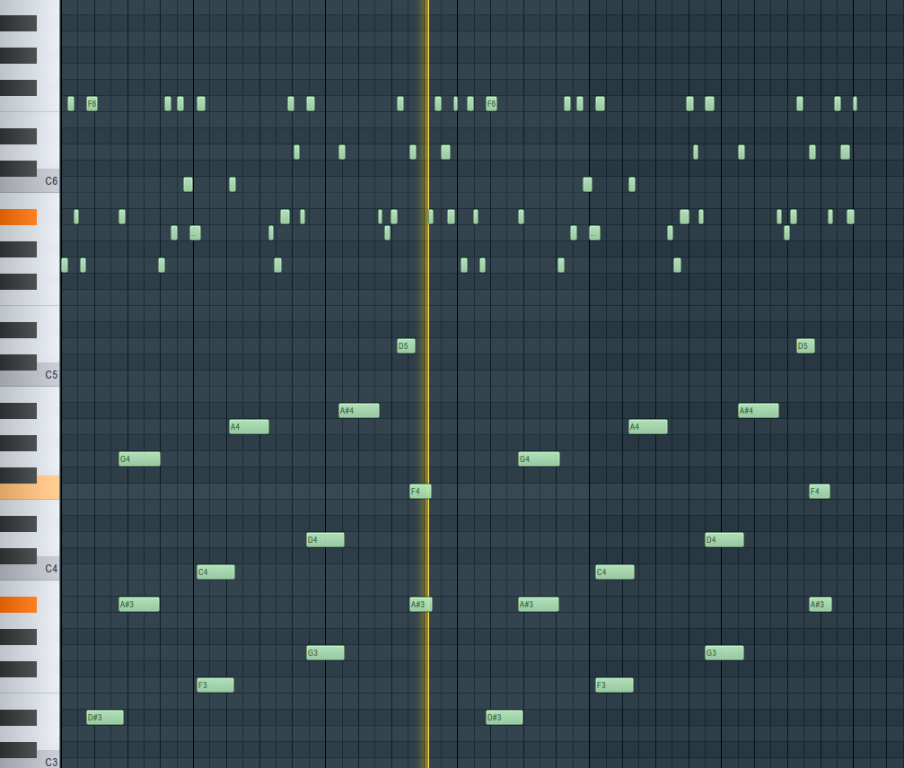

# Basic MIDI Transformer

A PyTorch implementation of a Transformer model for MIDI music generation. This model can learn patterns from MIDI files and generate new music sequences in a similar style.
###NOTE: This implementation has no proper beat quantization resulting in the melodies being "off beat". 
This is also a single track generator for single track melodies (e.g. no melodies + drums + bass). 


## Features

- Transformer-based architecture with Rotary Position Embedding (RoPE)
- Autoregressive text generation approach adapted for MIDI sequences
- Custom MIDI dataset loader with augmentation options
- Mixed precision training with gradient accumulation
- Real-time training visualization and sample generation
- Checkpointing system

## Setup

1. Create the following folder structure:
```bash
.
├── content
│   ├── dataset/      # Place your MIDI files here
│   ├── checkpoints/  # Model checkpoints will be saved here
│   └── samples/      # Generated samples will be saved here
```

2. Install the required dependencies:
```bash
pip install torch einops tqdm matplotlib
```

## Training

1. Place your MIDI files in the `content/dataset` folder
2. Adjust hyperparameters in the `Args` class if needed:

```python
class Args:
    def __init__(self):
        self.seq_len = 100        # Sequence length for training
        self.dim = 512            # Model dimension
        self.depth = 6            # Number of transformer layers
        self.heads = 8            # Number of attention heads
        self.dim_head = 64        # Dimension per head
        self.dropout = 0.1        # Dropout rate
        self.batch_size = 2       # Batch size
        self.grad_accum = 2       # Gradient accumulation steps
        self.lr = 3e-4            # Learning rate
        self.num_epochs = 60      # Number of training epochs
```

3. Run the training script:
```bash
python custom_training.py
```

## Model Architecture

The model uses a decoder-only transformer architecture with:
- Rotary Position Embeddings (RoPE) for better sequence understanding
- Multi-head self-attention with flash attention when available
- Feed-forward networks with GELU activation
- Layer normalization and residual connections

## Token System

The model uses the following token system:
- 0-127: Time delta values
- 128-255: Note durations  
- 256-833: MIDI pitches
- 834: Start token
- 835: Padding token

## MIDI Processing & Tokenization

The TMIDIX library converts MIDI files into a sequence of note events, where each note is represented as:
`['note', start_time, duration, channel, pitch, velocity]`

These note events are then tokenized into a sequence of integers by:
1. Converting absolute times to time deltas (time since last event)
2. Scaling time values by dividing by TIMING_FACTOR (default 32)
3. Converting each note into a triplet of [time_delta, duration, pitch] tokens
4. Adding special tokens for sequence start (834) and padding (835)

For example, a note event `['note', 96, 24, 0, 60, 90]` might become the tokens: `[3, 130, 316]` representing [time_delta=3, duration=2, pitch=60].

## Training Features

- Mixed precision training for faster execution
- Real-time loss and accuracy plotting
- Periodic validation
- Sample generation during training
- Model checkpointing
- Data augmentation with pitch transposition

## Sample Generation

The model can generate new MIDI sequences autoregressively. During training, samples are automatically generated every N steps (configurable via `args.generate_every`).

## File Structure

- `custom_basic_transformer.py`: Core transformer model implementation
- `custom_training.py`: Training loop and utilities  
- `dataset.py`: MIDI dataset loading and preprocessing

## Example Sample

-
[Audio Sample](./example_sample/generated_sample.mp3)
